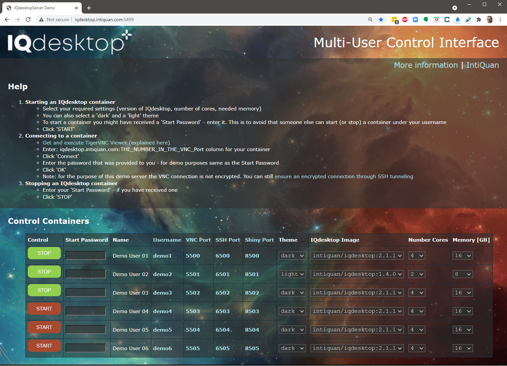

# IQdesktop Server
This repository contains needed scripts and material to set up a multi-user server environment for IQdesktop.

* Allow your users to 
    * Conveniently and securely start and stop their IQdesktop containers
	* Select the version of IQdesktop 
	* Select number of cores and amount of memory needed for their task
* Reduce system administration effort to a bare minimum
* Ensure 100% reproducibility of your analyses at any point in time
 

## Requirements
* Ubuntu 18/20.0.4 LTS Server
* Docker and docker-compose
* Apache, PHP
* Some additional utilities

## Availability
The contents of this repository can be freely used and modified.

## Support
For support and information around support options, contact info@intiquan.com.

